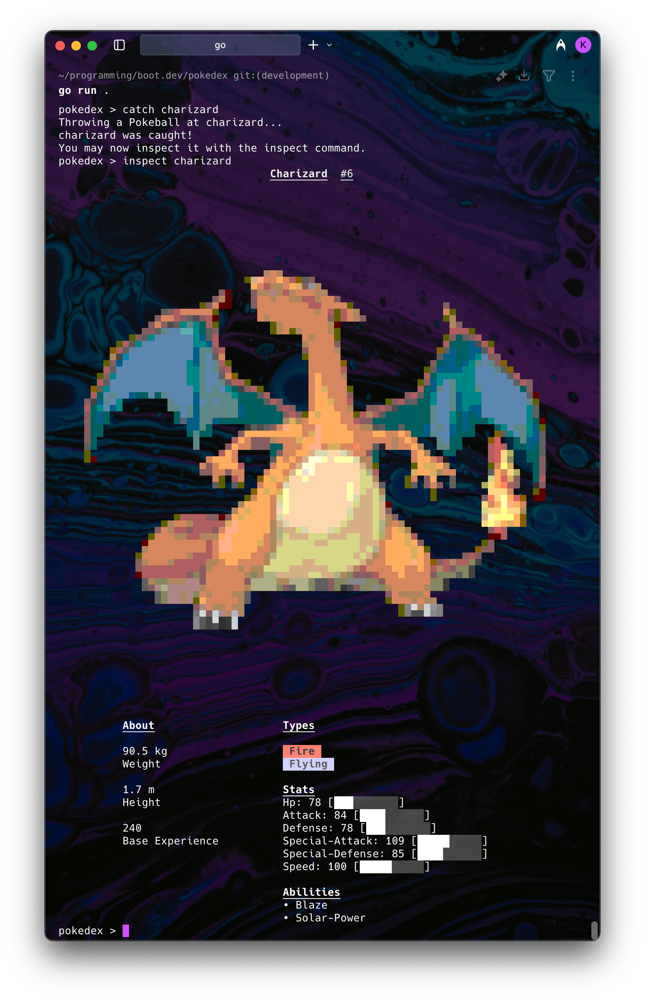

# Pokedex CLI

<div align="center">
  
</div>

## Description

A beautifully simple command-line Pokedex application built in Go that brings Pokemon to life with stunning ASCII art displays. This "just works" application requires zero configuration - simply build and run to enjoy gorgeous Pokemon inspection with high-quality ASCII sprites, type-based colors, and neofetch-style layouts.

## ✨ Key Features

### Beautiful Visual Experience
- **High-Quality ASCII Art**: Pokemon sprites converted to stunning 80x40 colored ASCII art
- **Neofetch-Style Layout**: Side-by-side ASCII art and detailed Pokemon information display
- **Type-Based Colors**: Water Pokemon are blue with cyan accents, Electric are yellow, Fire are red, etc.
- **Detailed Stats Display**: Visual stat bars showing HP, Attack, Defense, Special Attack, Special Defense, and Speed
- **Complete Pokemon Info**: Height, weight, base experience, abilities, and type information
- **Smart Caching**: Sprites cached locally for instant re-display (no internet needed after first view)
- **Terminal Width Detection**: Automatically adjusts display based on your terminal size
- **Just Works**: Zero configuration required - beautiful displays out of the box

### Core Pokemon Functionality
- **Realistic Catch Mechanics**: Challenging catch rates based on Pokemon base experience (stronger Pokemon are harder to catch)
- **Full Pokemon Database**: Access to complete Pokemon data with abilities, stats, and sprite information
- **Collection Management**: Store and browse your caught Pokemon with the `pokedex` command
- **Location Exploration**: Discover Pokemon in different areas using `map` and `explore` commands
- **Secure Input Validation**: All Pokemon names are validated to prevent injection attacks


## Installation & Quick Start

### Prerequisites
- Go 1.21+ (any recent version)
- Any terminal (beautiful colors and Unicode work everywhere)
- Internet connection (only for initial Pokemon data and sprite downloads)

### Build and Run - It's That Simple!

1. **Clone and build** (3 commands, that's it!):

   ```bash
   git clone https://github.com/kiefbc/pokedexcli.git
   cd pokedexcli
   go build -o pokedexcli
   ```

2. **Run and enjoy**:
   ```bash
   ./pokedexcli
   ```

That's it! No configuration files, no environment variables, no setup complexity. The application automatically:
- Creates a sprite cache in `~/.pokedex_sprites/` 
- Downloads and converts sprites to beautiful ASCII art as needed
- Works perfectly in any terminal with graceful fallbacks

## Usage

Once started, you'll see the Pokedex prompt:

```
pokedex > 
```

### Available Commands

- `help` - Display available commands and usage information
- `map` - Show the next page of location area maps
- `mapb` - Show the previous page of location area maps  
- `explore <area>` - Explore a specific area to find Pokemon
- `catch <pokemon>` - Attempt to catch a Pokemon (realistic catch rates!)
- `inspect <pokemon>` - View detailed Pokemon info with gorgeous ASCII art
- `pokedex` - List all Pokemon in your collection
- `exit` - Exit the Pokedex application

### Example Session

```bash
$ ./pokedexcli
pokedex > help
Welcome to the Pokedex!
Usage:

help: Displays a help message
exit: Exit the Pokedex
map: Get a list of area maps
mapb: Go back to previous list of maps
explore: Explore a specific area map
catch: Catch a specific Pokemon
inspect: View details of a caught Pokemon
pokedex: View all caught Pokemon
config: Show terminal configuration and display settings

pokedex > map
canalave-city-area
eterna-city-area
pastoria-city-area
...

pokedex > explore eterna-city-area
Found Pokemon:
- budew
- buizel
- staravia
...

pokedex > catch pikachu
Throwing a Pokeball at pikachu...
pikachu escaped!

pokedex > catch pikachu  
Throwing a Pokeball at pikachu...
pikachu was caught!

pokedex > inspect pikachu

⠀⠀⠀⠀⠀⠀⠀⠀⠀⠀⠀⠀⠀⢀⣀⣤⣤⣴⣶⣶⣶⣶⣤⣤⣀⡀⠀⠀⠀⠀⠀⠀⠀⠀⠀⠀⠀⠀⠀  ┏━━━━━━━━━━━━━━━━━━━━━━━━━━━━━━━━━━━━━━━━━━━┓
⠀⠀⠀⠀⠀⠀⠀⠀⠀⢀⣤⣶⣿⣿⣿⣿⣿⣿⣿⣿⣿⣿⣿⣿⣿⣿⣿⣷⣦⣄⠀⠀⠀⠀⠀⠀⠀⠀⠀  ┃ Pikachu (#25)                               ┃
⠀⠀⠀⠀⠀⠀⠀⢀⣴⣿⣿⣿⣿⣿⣿⣿⣿⣿⣿⣿⣿⣿⣿⣿⣿⣿⣿⣿⣿⣿⣿⣦⡀⠀⠀⠀⠀⠀⠀  ┣━━━━━━━━━━━━━━━━━━━━━━━━━━━━━━━━━━━━━━━━━━━┫
⠀⠀⠀⠀⠀⠀⣠⣾⣿⣿⣿⣿⣿⣿⣿⣿⣿⣿⣿⣿⣿⣿⣿⣿⣿⣿⣿⣿⣿⣿⣿⣿⣿⣄⠀⠀⠀⠀⠀  ┃ Height: 4 dm                                ┃
⠀⠀⠀⠀⠀⣰⣿⣿⣿⣿⣿⣿⣿⣿⣿⣿⣿⣿⣿⣿⣿⣿⣿⣿⣿⣿⣿⣿⣿⣿⣿⣿⣿⣿⣆⠀⠀⠀⠀  ┃ Weight: 60 hg                               ┃
⠀⠀⠀⠀⢰⣿⣿⣿⣿⣿⣿⣿⣿⣿⣿⣿⣿⣿⣿⣿⣿⣿⣿⣿⣿⣿⣿⣿⣿⣿⣿⣿⣿⣿⣿⡆⠀⠀⠀  ┃ Base Experience: 112                       ┃
⠀⠀⠀⢀⣿⣿⣿⣿⣿⣿⣿⣿⣿⣿⣿⣿⣿⣿⣿⣿⣿⣿⣿⣿⣿⣿⣿⣿⣿⣿⣿⣿⣿⣿⣿⣿⡀⠀⠀  ┃ Type: Electric                              ┃
⠀⠀⠀⣼⣿⣿⣿⣿⣿⣿⣿⣿⣿⣿⣿⣿⣿⣿⣿⣿⣿⣿⣿⣿⣿⣿⣿⣿⣿⣿⣿⣿⣿⣿⣿⣿⣧⠀⠀  ┃ Abilities: Static, Lightning-Rod             ┃
⠀⠀⢸⣿⣿⣿⣿⣿⣿⣿⣿⣿⣿⣿⣿⣿⣿⣿⣿⣿⣿⣿⣿⣿⣿⣿⣿⣿⣿⣿⣿⣿⣿⣿⣿⣿⣿⡇⠀  ┣━━━━━━━━━━━━━━━━━━━━━━━━━━━━━━━━━━━━━━━━━━━┫
⠀⠀⣾⣿⣿⣿⣿⣿⣿⣿⣿⣿⣿⣿⣿⣿⣿⣿⣿⣿⣿⣿⣿⣿⣿⣿⣿⣿⣿⣿⣿⣿⣿⣿⣿⣿⣿⣷⠀  ┃ STATS                                       ┃
⠀⠀⣿⣿⣿⣿⣿⣿⣿⣿⣿⣿⣿⣿⣿⣿⣿⣿⣿⣿⣿⣿⣿⣿⣿⣿⣿⣿⣿⣿⣿⣿⣿⣿⣿⣿⣿⣿⠀  ┃ Hp: 35      [███████░░░░░░░░░░░░░]           ┃
⠀⠀⢿⣿⣿⣿⣿⣿⣿⣿⣿⣿⣿⣿⣿⣿⣿⣿⣿⣿⣿⣿⣿⣿⣿⣿⣿⣿⣿⣿⣿⣿⣿⣿⣿⣿⣿⡿⠀  ┃ Attack: 55  [███████████░░░░░░░░░░]         ┃
⠀⠀⠘⣿⣿⣿⣿⣿⣿⣿⣿⣿⣿⣿⣿⣿⣿⣿⣿⣿⣿⣿⣿⣿⣿⣿⣿⣿⣿⣿⣿⣿⣿⣿⣿⣿⣿⠃⠀  ┃ Defense: 40 [████████░░░░░░░░░░░░░]         ┃
⠀⠀⠀⠹⣿⣿⣿⣿⣿⣿⣿⣿⣿⣿⣿⣿⣿⣿⣿⣿⣿⣿⣿⣿⣿⣿⣿⣿⣿⣿⣿⣿⣿⣿⣿⣿⠏⠀⠀  ┃ Speed: 90   [██████████████████░░]          ┃
⠀⠀⠀⠀⠙⢿⣿⣿⣿⣿⣿⣿⣿⣿⣿⣿⣿⣿⣿⣿⣿⣿⣿⣿⣿⣿⣿⣿⣿⣿⣿⣿⣿⣿⡿⠋⠀⠀⠀  ┗━━━━━━━━━━━━━━━━━━━━━━━━━━━━━━━━━━━━━━━━━━━┛
⠀⠀⠀⠀⠀⠀⠙⠻⢿⣿⣿⣿⣿⣿⣿⣿⣿⣿⣿⣿⣿⣿⣿⣿⣿⣿⣿⣿⣿⣿⣿⣿⡿⠟⠋⠀⠀⠀⠀
     Electric Mouse Pokemon

pokedex > pokedex
Your Pokedex:
- pikachu
- charizard
- squirtle

pokedex > exit
Closing the Pokedex... Goodbye!
```

## The "Just Works" Philosophy

This Pokedex was designed with simplicity in mind:

✅ **Zero Configuration**: No config files, no environment variables, no setup complexity  
✅ **Beautiful by Default**: High-quality ASCII art and colors work out of the box  
✅ **Smart Caching**: Sprites cached automatically for instant re-display  
✅ **Realistic Gameplay**: Catch rates based on Pokemon difficulty (legendary Pokemon are harder!)  
✅ **Universal Compatibility**: Works in any terminal with graceful fallbacks  

### Troubleshooting (Rare Issues)

The application is designed to "just work", but if you experience issues:

**ASCII art looks wrong**: Your terminal might not support UTF-8. This is very rare with modern terminals.

**No colors**: Your terminal might be very old. Colors will be disabled automatically but functionality remains.

**Slow first-time sprite loading**: Sprites are downloaded once and cached forever. Subsequent views are instant.

**Clear sprite cache** (if needed): `rm -rf ~/.pokedex_sprites/`

## Development

### Testing

Run the full test suite:
```bash
go test
```

Run tests with verbose output:
```bash
go test -v
```

Run a specific test:
```bash
go test -run TestFunctionName
```

### Code Formatting

Format the codebase:
```bash
go fmt ./...
```

### Dependencies

Update dependencies:
```bash
go mod tidy
```

## Simple Architecture

This application follows a clean, simple architecture:

### Core Files (All You Need to Know)
- **main.go**: REPL loop and command processing  
- **commands/command_inspect.go**: Beautiful ASCII art Pokemon display (230 lines)
- **internal/sprites/sprites.go**: Simple sprite caching system (60 lines)
- **commands/command_catch.go**: Pokemon catching with realistic rates
- **commands/command.go**: Data structures and shared utilities

### What Makes It Simple
- **Minimal Dependencies**: Only essential libraries for ASCII art and colors
- **Direct Approach**: No complex configuration systems or environment detection
- **Smart Defaults**: Everything configured for the best experience out of the box
- **Clean Caching**: Simple disk cache for sprites, HTTP cache for API responses
- **Type Safety**: Strong Go typing prevents runtime errors

Total enhancement code: ~300 lines. Original complex system was 2000+ lines.


## Contributing

This project follows standard Go conventions. Please ensure all tests pass and code is formatted before submitting contributions.

### Development Setup
```bash
# Run tests
go test -v

# Format code
go fmt ./...

# Build
go build -o pokedexcli
```